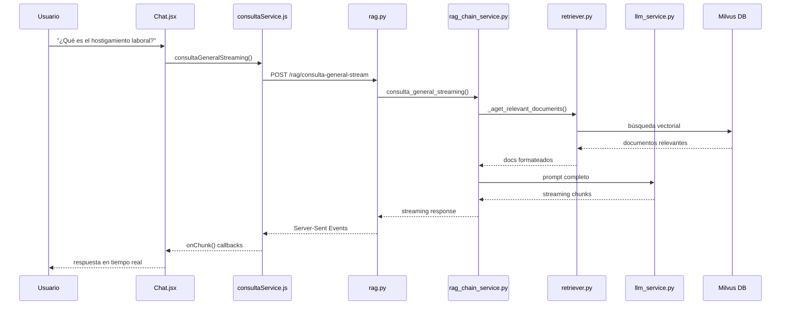
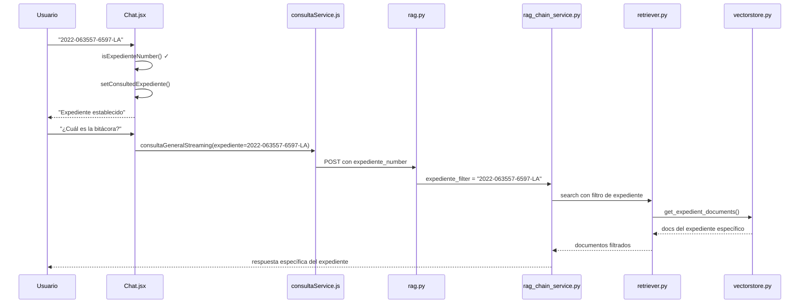

# 🤖 Mapa de Funcionamiento del Asistente JusticIA

## 📋 Índice
1. [Visión General](#visión-general)
2. [Arquitectura del Sistema](#arquitectura-del-sistema)
3. [Flujo de Consulta General](#flujo-de-consulta-general)
4. [Flujo de Consulta Específica](#flujo-de-consulta-específica)
5. [Componentes Principales](#componentes-principales)
6. [Contexto de Conversación](#contexto-de-conversación)
7. [Sistema RAG (Retrieval-Augmented Generation)](#sistema-rag)
8. [Archivos Clave](#archivos-clave)

## 🎯 Visión General

JusticIA es un asistente de IA especializado en derecho costarricense que opera en dos modalidades principales:

### 🔍 **Consulta General**
- Búsquedas amplias sobre temas legales
- Usa toda la base de datos de expedientes
- Mantiene contexto de conversación
- Ideal para preguntas conceptuales o búsquedas exploratorias

### 📄 **Consulta Específica por Expediente**
- Consultas dirigidas a un expediente particular
- Requiere número de expediente válido (formato: YYYY-NNNNNN-NNNN-XX)
- Respuestas precisas sobre el expediente seleccionado
- Ideal para revisión detallada de casos específicos

---

## 🏗️ Arquitectura del Sistema

```
┌─────────────────────────────────────────────────┐
│                   FRONTEND                      │
│  Next.js + React + TailwindCSS + NextAuth     │
├─────────────────────────────────────────────────┤
│                     API                         │
│            FastAPI + Python                     │
├─────────────────────────────────────────────────┤
│                  SERVICIOS                      │
│      RAG Chain + LLM Service + Retriever       │
├─────────────────────────────────────────────────┤
│                BASE DE DATOS                    │
│           PostgreSQL + Milvus Vector            │
└─────────────────────────────────────────────────┘
```

---

## 🔄 Flujo de Consulta General

### 1. **Frontend (Chat.jsx)**
```javascript
// Ubicación: frontend/components/consulta-datos/chat/Chat.jsx
searchScope = 'general'
```

**🔸 Funciones principales:**
- Captura mensaje del usuario
- Mantiene estado de conversación en memoria
- Usa `useChatContext` para gestionar historial
- Envía consulta via `consultaService`

### 2. **Servicio de Consulta (Frontend)**
```javascript
// Ubicación: frontend/services/consultaService.js
consultaGeneralStreaming(query, onChunk, onComplete, onError, topK, conversationContext)
```

**🔸 Proceso:**
- Prepara contexto de conversación si existe
- Construye payload con query + contexto
- Envía POST a `/rag/consulta-general-stream`
- Maneja streaming response con Server-Sent Events

### 3. **Ruta RAG (Backend)**
```python
# Ubicación: backend/app/routes/rag.py
@router.post("/consulta-general-stream")
```

**🔸 Validaciones:**
- Seguridad del input del usuario
- Extracción de contexto de conversación
- Detección de números de expediente en la consulta
- Preparación de parámetros para RAG

### 4. **RAG Chain Service**
```python
# Ubicación: backend/app/services/RAG/rag_chain_service.py
async def consulta_general_streaming(pregunta, top_k, conversation_context, expediente_filter)
```

**🔸 Proceso RAG:**
1. **Análisis de Intención**: Determina si usar solo contexto o buscar en BD
2. **Retrieval Dinámico**: Busca documentos relevantes usando vectores
3. **Formateo de Contexto**: Organiza documentos encontrados
4. **Construcción de Prompt**: Combina pregunta + contexto recuperado + historial
5. **Delegación a LLM**: Envía prompt completo al modelo de lenguaje

### 5. **Retriever Dinámico**
```python
# Ubicación: backend/app/services/RAG/retriever.py
class DynamicJusticIARetriever
```

**🔸 Capacidades:**
- Búsqueda vectorial semántica en Milvus
- Resolución de referencias contextuales ("el último caso", "ese expediente")
- Filtrado por expedientes específicos
- Análisis de expedientes mencionados en la sesión

### 6. **LLM Service**
```python
# Ubicación: backend/app/llm/llm_service.py
async def consulta_general_streaming(prompt_completo)
```

**🔸 Función:**
- Interfaz con Ollama (modelo local)
- Streaming de respuesta al frontend
- Gestión de buffers y chunks de texto

---

## 📄 Flujo de Consulta Específica

### Diferencias clave con Consulta General:

#### **1. Validación de Expediente**
```javascript
// En Chat.jsx
if (searchScope === 'expediente' && !consultedExpediente) {
  if (isExpedienteNumber(text)) {
    setConsultedExpediente(text.trim());
    // Confirmar establecimiento del expediente
  } else {
    // Solicitar número válido
  }
}
```

#### **2. Filtrado Específico**
```python
# En rag.py
expediente_filter = expediente_match.group(1) if expediente_match else ""
if expediente_filter:
    search_query = f"Expediente {expediente_filter}: {search_query}"
```

#### **3. Búsqueda Dirigida**
```python
# En retriever.py - Cuando detecta expediente específico
if expediente_match:
    expediente_directo = expediente_match.group()
    docs = await get_expedient_documents(expediente_directo, top_k=self.top_k)
```

---

## 🧩 Componentes Principales

### **Frontend Components**

| Componente | Ubicación | Función |
|------------|-----------|---------|
| `Chat.jsx` | `components/consulta-datos/chat/` | Interfaz principal del chat |
| `MessageList.jsx` | `components/consulta-datos/chat/` | Lista de mensajes |
| `ChatInput.jsx` | `components/consulta-datos/chat/` | Input de usuario |
| `SearchScopeSelector.jsx` | `components/consulta-datos/chat/` | Selector General/Específico |
| `ConversationHistory.jsx` | `components/consulta-datos/chat/` | Historial de conversaciones |

### **Frontend Services**

| Servicio | Ubicación | Función |
|----------|-----------|---------|
| `consultaService.js` | `services/` | Comunicación con API de consultas |
| `httpService.js` | `services/` | Cliente HTTP base |

### **Frontend Hooks**

| Hook | Ubicación | Función |
|------|-----------|---------|
| `useChatContext.js` | `hooks/conversacion/` | Gestión de contexto de chat |

### **Backend Routes**

| Ruta | Ubicación | Endpoint | Función |
|------|-----------|----------|---------|
| `rag.py` | `app/routes/` | `/rag/consulta-general-stream` | Endpoint principal de consultas |

### **Backend Services**

| Servicio | Ubicación | Función |
|----------|-----------|---------|
| `rag_chain_service.py` | `app/services/RAG/` | Orquestador principal del RAG |
| `retriever.py` | `app/services/RAG/` | Búsqueda vectorial dinámica |
| `prompt_builder.py` | `app/services/RAG/` | Construcción de prompts |
| `context_formatter.py` | `app/services/RAG/` | Formateo de contexto |
| `llm_service.py` | `app/llm/` | Interfaz con modelo de lenguaje |

---

## 🧠 Contexto de Conversación

### **Gestión en Frontend**
```javascript
// Hook: useChatContext.js
const { 
  addToContext,         // Agregar intercambio usuario-asistente
  getFormattedContext,  // Obtener contexto formateado para backend
  clearContext,         // Limpiar contexto
  hasContext,          // Verificar si hay contexto
  getContextStats      // Estadísticas del contexto
} = useChatContext();
```

### **Procesamiento en Backend**
```python
# En rag.py - Extracción de contexto
if request.has_context and "\n\n---\nNUEVA CONSULTA:" in request.query:
    parts = request.query.split("\n\n---\nNUEVA CONSULTA:")
    conversation_context = parts[0].strip()
    actual_query = parts[1].strip()
```

### **Formato del Contexto**
```
HISTORIAL DE CONVERSACIÓN PREVIA:

Usuario: [Pregunta anterior 1]
Asistente: [Respuesta anterior 1]

Usuario: [Pregunta anterior 2]  
Asistente: [Respuesta anterior 2]

---
NUEVA CONSULTA: [Pregunta actual]
```

---

## 🔍 Sistema RAG (Retrieval-Augmented Generation)

### **1. Análisis de Intención**
```python
# En context_analyzer.py
intent_analysis = context_analyzer.analyze_query_intent(
    actual_query, 
    has_context=bool(conversation_context)
)
```

**Tipos de intención:**
- `context_only`: Responder solo con historial de conversación
- `search_required`: Requiere búsqueda en base de datos

### **2. Búsqueda Vectorial**
```python
# En retriever.py
docs = await retriever._aget_relevant_documents(search_query)
```

**Proceso:**
1. **Embedding** de la consulta
2. **Búsqueda semántica** en Milvus
3. **Filtrado** por expediente si aplica
4. **Ranking** por relevancia

### **3. Formateo de Contexto**
```python
# En context_formatter.py
context = format_documents_context_adaptive(docs, query=pregunta, context_importance="high")
```

### **4. Construcción de Prompt**
```python
# En prompt_builder.py
prompt_text = create_justicia_prompt(
    pregunta=pregunta, 
    context=context, 
    conversation_context=conversation_context
)
```

**Estructura del prompt final:**
```
Eres JusticIA, asistente especializado en derecho costarricense.

INFORMACIÓN RELEVANTE DE LA BASE DE DATOS:
[Documentos recuperados]

HISTORIAL DE CONVERSACIÓN:
[Contexto de conversación si existe]

PREGUNTA DEL USUARIO:
[Pregunta actual]

INSTRUCCIONES:
[Reglas específicas para responder]
```

---

## 📁 Archivos Clave

### **🎨 Frontend**

#### **Páginas**
- `frontend/pages/consulta-datos/chat/index.js` - Página principal del chat

#### **Componentes Principales**
- `frontend/components/consulta-datos/chat/Chat.jsx` - **CORE** - Lógica principal del chat
- `frontend/components/consulta-datos/chat/MessageList.jsx` - Renderizado de mensajes
- `frontend/components/consulta-datos/chat/ChatInput.jsx` - Input del usuario
- `frontend/components/consulta-datos/chat/SearchScopeSelector.jsx` - Selector de modalidad

#### **Servicios**
- `frontend/services/consultaService.js` - **CORE** - Comunicación con backend
- `frontend/services/httpService.js` - Cliente HTTP base

#### **Hooks**
- `frontend/hooks/conversacion/useChatContext.js` - **CORE** - Gestión de contexto

### **⚙️ Backend**

#### **Rutas API**
- `backend/app/routes/rag.py` - **CORE** - Endpoint principal `/rag/consulta-general-stream`

#### **Servicios RAG**
- `backend/app/services/RAG/rag_chain_service.py` - **CORE** - Orquestador RAG
- `backend/app/services/RAG/retriever.py` - **CORE** - Búsqueda vectorial dinámica
- `backend/app/services/RAG/prompt_builder.py` - Construcción de prompts
- `backend/app/services/RAG/context_formatter.py` - Formateo de contexto

#### **Servicios Base**
- `backend/app/llm/llm_service.py` - **CORE** - Interfaz con Ollama
- `backend/app/services/context_analyzer.py` - Análisis de intención
- `backend/app/vectorstore/vectorstore.py` - Operaciones con Milvus

#### **Configuración**
- `backend/app/config/config.py` - Configuración de LLM y servicios
- `backend/main.py` - Aplicación principal FastAPI

---

## 🚀 Flujo Completo de una Consulta

### **Ejemplo: Consulta General**



### **Ejemplo: Consulta Específica**



---

## ⚡ Características Avanzadas

### **🔄 Streaming en Tiempo Real**
- Server-Sent Events (SSE) para respuestas progresivas
- Bufferizado inteligente de chunks
- Cancelación de consultas en progreso

### **🧠 Resolución Contextual**
- Detección automática de referencias ("el último caso", "ese expediente")
- Mantención de expedientes de la sesión
- Análisis de intención de consultas

### **🎯 Búsqueda Inteligente**
- Parámetros dinámicos según tipo de consulta
- Filtrado por expediente específico
- Ranking por relevancia semántica

### **🔒 Validación de Seguridad**
- Sanitización de inputs
- Validación de formatos de expediente
- Gestión de errores y timeouts

---

## 📊 Métricas y Logs

### **Logs Principales**
```python
# Seguimiento en rag_chain_service.py
print(f"🚨🚨🚨 RAG CHAIN SERVICE - EJECUTÁNDOSE! Pregunta: '{pregunta}'")
print(f"🔍 BÚSQUEDA EN BD: '{search_query}' (sin contexto histórico)")
print(f"📄 DOCUMENTOS ENCONTRADOS: {len(docs)} documentos")
```

### **Estadísticas de Contexto**
```javascript
// En useChatContext.js
const contextStats = {
  totalInterchanges: contextHistory.length,
  totalChars: /* cálculo de caracteres */,
  sessionKey: /* identificador de sesión */
}
```

---

**📋 Este mapa proporciona una visión completa del funcionamiento del asistente JusticIA, desde la interfaz de usuario hasta la base de datos vectorial.**